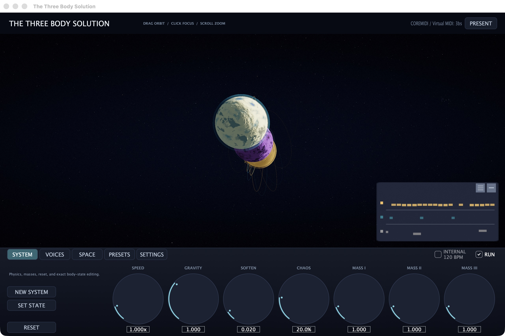

# The Three Body Solution

The Three Body Solution (`3bs`) is a deterministic
generative MIDI instrument and cinematic planetary artwork. Three bodies move
through a fixed-step gravitational simulation; their distances, velocities,
phases, and crossings become three interlocking musical voices.

[](https://krahd.github.io/3bs/)

**[Project website](https://krahd.github.io/3bs/)** ·
**[Download v0.1.0-alpha.1](https://github.com/krahd/3bs/releases/tag/v0.1.0-alpha.1)** ·
**[Installation guide](doc/INSTALL.md)** ·
**[Project status](STATUS.md)**

> [!WARNING]
> The downloadable Apple silicon binaries are alpha software. They are ad-hoc
> signed, not notarized, and have not completed Logic or Ableton host validation.

## Three Formats, One Engine

| Format | Role | Typical use |
| --- | --- | --- |
| Audio Unit | Logic MIDI effect | Insert before a software instrument |
| VST3 | MIDI-generating instrument | Route MIDI output to an instrument track |
| Standalone | CoreMIDI application | Send a virtual or physical MIDI output without a DAW |

All three surfaces share the same C++20 simulation and mapping engine. Given the
same seed, state, transport, and inputs, the musical result is reproducible and
independent of audio block size.

## What It Does

- Runs a fixed-step, double-precision three-body simulation in normalized
  artistic units.
- Maps orbital relationships to pitch, trigger, velocity, duration, and CC
  streams across three independently configurable voices.
- Provides independent, chord, and strum modes with deterministic scheduling.
- Renders procedural planets, atmospheres, trajectories, a pinned HYG star
  catalogue, HDR bloom, and six seconds of live body-coloured note history.
- Ships 24 deterministic factory systems and portable, human-readable `.3bs`
  configuration files.
- Keeps rendering off the MIDI processing thread and uses fixed-capacity queues
  for real-time communication.

## Install a Release

Download the [complete bundle or one format][release], verify its published
SHA-256 checksum, and follow the [installation guide](doc/INSTALL.md). Releases
target Apple silicon Macs running macOS 13 or newer.

The standalone creates a virtual CoreMIDI output and can select an existing
destination. It generates MIDI rather than audio. Press `P` for presentation
mode and `F` for fullscreen.

## Build From Source

Requirements:

- Apple silicon Mac running macOS 13 or newer
- Xcode and its command-line tools
- CMake 3.22 or newer
- Git with submodule support

JUCE 8.0.13 is pinned as a submodule. Build and test the framework-independent
core:

```bash
git clone --recurse-submodules https://github.com/krahd/3bs.git
cd 3bs
cmake --preset dev
cmake --build --preset dev -j 8
ctest --preset dev --output-on-failure
```

Build the AU, VST3, standalone, and integration tests:

```bash
cmake --preset plugin-debug
cmake --build --preset plugin-debug -j 8
ctest --preset plugin-debug --output-on-failure
```

Debug bundles are written below `build/plugin-debug`:

- `src/plugin/ThreeBSAU_artefacts/Debug/AU/`
- `src/plugin/ThreeBSVST3_artefacts/Debug/VST3/`
- `src/standalone/ThreeBSStandalone_artefacts/Debug/`

Local builds are ad-hoc signed by default. Set `THREEBS_ADHOC_SIGN=OFF` for a
Developer ID signing and notarization workflow.

## Use It

The control deck has five pages:

- **System:** run state, physics, masses, deterministic randomization, and exact
  initial position/velocity editing.
- **Voices:** per-body enable, root, scale, pitch mapping, trigger mapping, plus
  shared chord and strum controls.
- **Space:** density, trails, bloom, orbital-plane tilts, automatic framing, and
  camera limits.
- **Presets:** 24 factory systems grouped by orbital family.
- **Settings:** portable `.3bs` save/load and standalone MIDI destination.

Drag the scene to orbit, scroll to zoom, click a body to follow it, and click the
background to return to the barycenter. Double-click the background to fit all
bodies while preserving the view angle. Manual zoom disables auto-frame until
it is re-enabled on the Space page.

## Architecture and State

`src/core/` owns physics, measurements, mapping, scheduling, deterministic PRNG
state, and bounded queues. JUCE adapters translate host transport and MIDI for
the plugin and standalone surfaces. Metal consumes immutable render snapshots
and a separate note-event queue, so renderer failure is non-fatal to MIDI.

Schema-v5 host state stores exact simulation vectors, musical mappings, camera
and pane state, and non-automatable presentation controls. Schemas v1-v4 migrate
with compatible defaults. Factory presets remain schema v2. See
[`STATUS.md`](STATUS.md) for diagrams, test records, and current risks.

## Host Routing

Logic uses `3bs` as an AU MIDI effect before a software instrument. Ableton uses
the VST3 on one MIDI track and receives its output on another. Because Ableton
merges internally routed MIDI channels, independent instruments require
multiple instances or a multitimbral destination.

Local AU validation command:

```bash
auval -v aumi Tbs1 Krhd
```

## Documentation

- [Installation and release use](doc/INSTALL.md)
- [Operational status and architecture](STATUS.md)
- [Original project description](doc/project-initial-description.md)
- [Historical implementation tasks](doc/)
- [Contributor instructions](AGENTS.md)

## Licensing

Copyright © 2026 Tomas Laurenzo.

The project is free software under the GNU Affero General Public License version
3 only. See [`LICENSE`](LICENSE). Distributed binaries are accompanied by the
corresponding source and build information. Third-party notices are recorded in
[`THIRD_PARTY_NOTICES.md`](THIRD_PARTY_NOTICES.md).

[release]: https://github.com/krahd/3bs/releases/tag/v0.1.0-alpha.1
